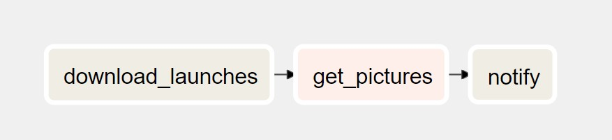

# Rocket-Launch-Images-Airflow
The Rocket Launch Project is an Apache Airflow-based ETL pipeline that extracts data from a public API, processes it, and stores it locally within a Docker containerized environment.

# Description
The Rocket Launch Project is an example of an Apache Airflow-based ETL (Extract, Transform, Load) pipeline designed to pull data from a public API, process the data, and store it locally. The project demonstrates how to use Airflow's powerful scheduling and data pipeline capabilities within a Docker containerized environment.

# Graph View of the DAGS Task


# Features
* Data Extraction: Uses requests to fetch upcoming rocket launch data from the SpaceDevs API.
* Data Processing: Implements Airflow DAGs (Directed Acyclic Graphs) to manage and automate workflows.
* Containerization: Runs Airflow and its dependencies inside Docker containers for a consistent and reproducible setup.
* Local Storage: Saves extracted data to a local directory mounted from the host machine.

# Technologies Used
* Apache Airflow: Orchestrates and schedules the data pipeline tasks.
* Docker: Provides containerization for the development and deployment environment.
* Python: The primary programming language used for scripting and data manipulation.
* Requests: A simple, yet powerful library for making HTTP requests in Python.

# Setup Instructions
### 1. Clone the repository:
```
git clone https://github.com/your-username/rocket-launch-project.git
cd rocket-launch-project
```
### 2. Build the Docker image:
```
docker build -t airflow-rocket-launch .
```
### 3. Run the Docker container:
```
# Edit the Local path as per your need
docker run --rm -d -p 8080:8080 -v /d/Apache-airflow/Rocket_launch_project/tmp:/opt/airflow/tmp airflow-rocket-launch
```
### 4. Access the Airflow web interface:
Open your browser and navigate to http://localhost:8080 to access the Airflow UI.

# Project Structure(Only important files/folders)
```
rocket-launch-project/
├── dags/
│   └── main.py               # Airflow DAG definition
├── tmp/
│   └── images/               # To store file locally
│   └── launches.json         # Response JSON file
├── Dockerfile                # Dockerfile to build the image
├── constraints-3.8.txt       # Python dependencies
└── README.md                 # Project documentation
```


